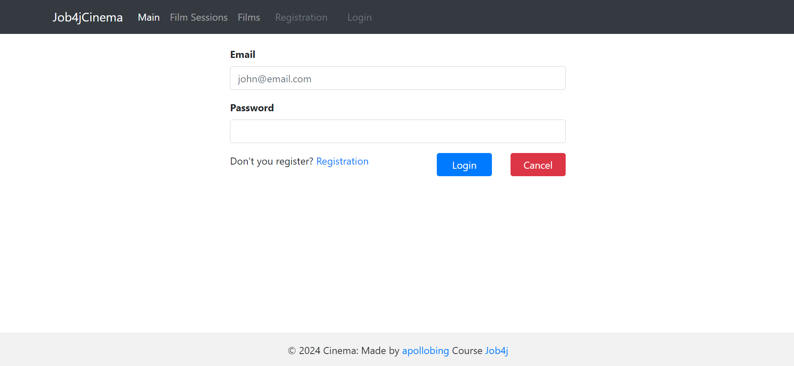
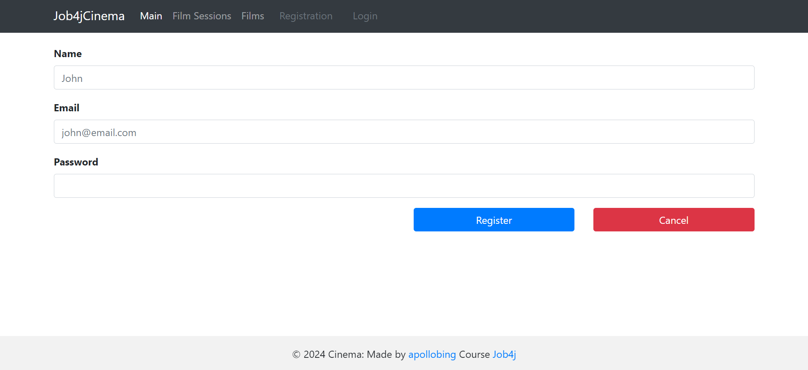
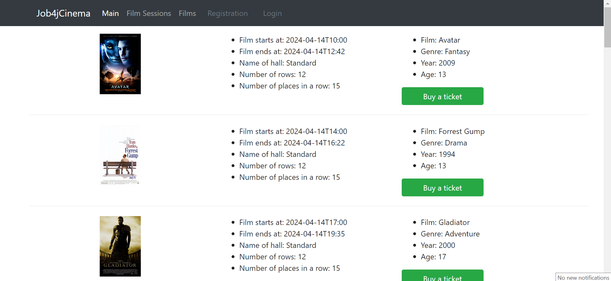
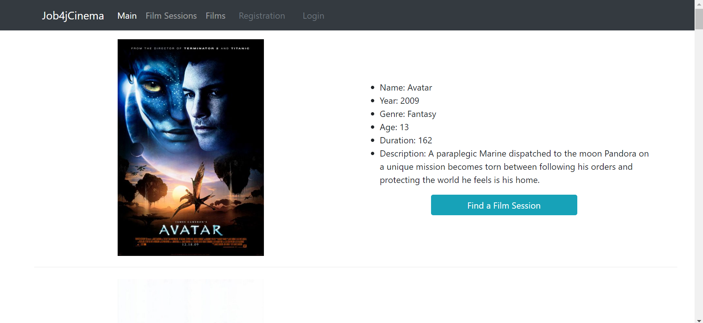
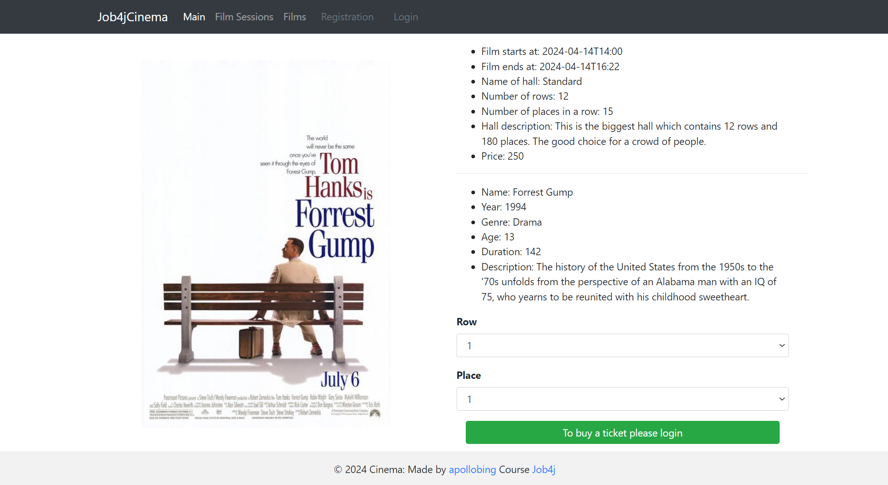
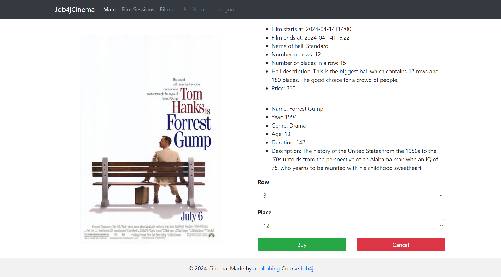
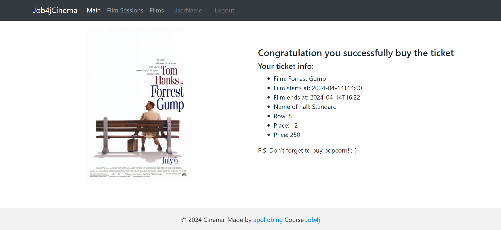

# job4j_cinema

## About project

Job4jCinema project is a service where you can buy tickets to the movie theater.
It allows you to register a new user or login if you already register.
Service shows you info about film sessions and films.
Also, as mentioned before, it allows you to buy a tickets.
Data about new users and tickets saves in DB.

Technologies used in the project:
- Spring boot 2.7.6
- Tomcat 9.0.69
- Thymeleaf 3.0.15
- Bootstrap 4.1.3
- Liquibase 4.15.0
- PostgreSQL 42.5.1
- h2database 2.1.214
- Sql2o 1.6.0
- commons-dbcp2 2.9.0
- Junit 5.8.2
- AssertJ 3.22.0
- Mockito 4.5.1
- SLF4J 1.7.36
- jcip-annotations 1.0
- checkstyle-plugin 3.1.2
- puppycrawl 10.3.3

Necessary environment:
- Java 17
- Maven 3.9.4
- PostgreSQL 14

To run the application you need:

1. Create a database named `cinema` in PostgreSQL
```
    create database cinema;
```

2. In Profiles section on Maven tab choose `production` profile


3. Build the project and run the Spring Boot application
```
    mvn clean install -Pproduction
    mvn spring-boot:run
```
`Or instead of mvn spring-boot:run command, please run main() method in Main class`

4. Open http://localhost:8080/ in your browser


5. Optional: if needed test environment, you can choose `test` profile in Profiles section on Maven tab
   and execute commands:
   - `mvn clean install -Ptest`
   - `mvn spring-boot:run`
      - `Or instead of mvn spring-boot:run command, please run main() method in Main class`
### Screenshots

#### Pages with user authorization and authentication:



#### Index page:


#### Film sessions page:


#### Films page:


#### Ticket page (without authorization):


#### Ticket page (with authorization):


#### Ticket page successful buying:


If you have any questions about this project, please let me know.